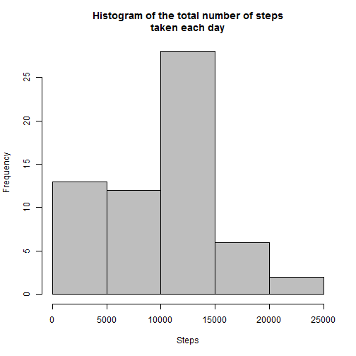
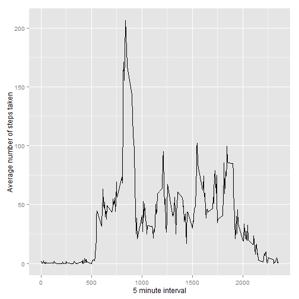
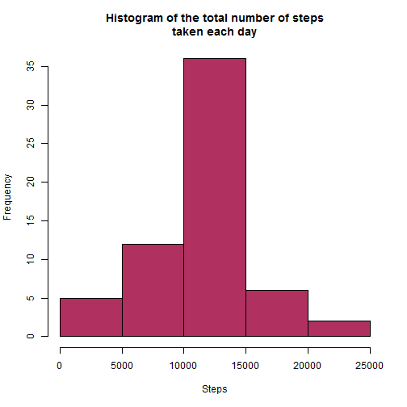
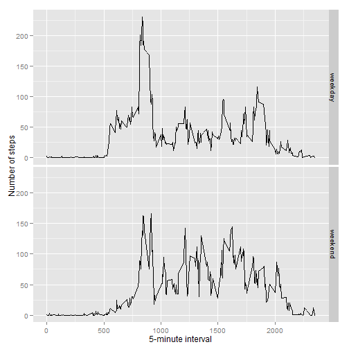

# Activity Monitoring  
#### Rajat Shubhra Gupta  
##### Saturday, September 13, 2014  

---

##### The purpose of this RMarkDown document is to perform analysis of the data collected by a personal activity monitoring device.

The dataset for this analysis is available [here](https://d396qusza40orc.cloudfront.net/repdata%2Fdata%2Factivity.zip). It is assumed that the code executes at the location where the data set is already downloaded and made available.

***

<b style="color:red">Item 1:</b>

- Loading and preprocessing the data
  

```r
## read the data using the csv function
activityData <- read.csv(file = "activity.csv", header = T)

## looking for the details of the structure of the data frame 
str(activityData)
```

```
## 'data.frame':	17568 obs. of  3 variables:
##  $ steps   : int  NA NA NA NA NA NA NA NA NA NA ...
##  $ date    : Factor w/ 61 levels "2012-10-01","2012-10-02",..: 1 1 1 1 1 1 1 1 1 1 ...
##  $ interval: int  0 5 10 15 20 25 30 35 40 45 ...
```

```r
## get the total number of steps taken each day;
sumActivity <- tapply(activityData$steps, activityData$date, FUN = sum, na.rm = TRUE)
```
  
<b style="color:red">Item 2:</b>

- Make a histogram of the total number of steps taken each day
- Calculate and report the mean and median total number of steps taken per day  

Plot the histogram based on the dataset that holds the aggregate of the total number of steps taken each day


```r
hist(sumActivity, 
     xlab = "Steps", 
     main = "Histogram of the total number of steps\ntaken each day", 
     axes = T, col = "grey")
```

 

The mean for the total number of steps taken each day : **9354**  

The median for the total number of steps taken each day : **10395**

***  
<b style="color:red">Item 3:</b>

- Make a time series plot (i.e. type = "l") of the 5-minute interval (x-axis) and the average number of steps taken, averaged across all days (y-axis)
- Which 5-minute interval, on average across all the days in the dataset, contains the maximum number of steps?


```r
## Create a subset from the parent activityData dataset that has the average of the steps taken averaged across all days
averageSteps <- aggregate(activityData$steps~activityData$interval,
                          FUN=mean, na.rm=T)
names(averageSteps)<-c("interval", "steps")
```

Create the time series plot

```r
library(ggplot2)
ggplot(data=averageSteps, aes(x=interval, y=steps)) +
    geom_line() +
    xlab("5 minute interval") +
    ylab("Average number of steps taken")
```

 

Identify the 5 minute interval that contains the maximum number of steps, on average across all the days in the dataset

```r
## get the index at which the maximum steps are available in the averageSteps dataset 
## and then report the interval and the maximum  number
x<-which.max(averageSteps$steps)
```
The **835^th^**, 5-minute interval has the maximum of **206.1698** steps.

***
<b style="color:red">Item 4:</b>

- Inputting missing values  

- Calculate and report the total number of missing values in the dataset (i.e. the total number of rows with NAs)


```r
## Create a logical vector
missing <- is.na(activityData$steps)
```

The total number of missing step values in the original dataset : **2304**
    
- A strategy for filling up the missing values with the mean of its 5-minute interval

```r
## create a function that will take in the given steps and interval
## if the steps is NA, then retrieve the average step value for the given interval from ## the earlier computed dataset, otherwise leave the value as it is
missingValues <- function(steps, interval) {
  ## set the intial value to NA
  values <- NA 
  ## check if the passed in step is NA or not
    if (!is.na(steps))
        values <- c(steps)
    else
        values <- (averageSteps[averageSteps$interval==interval, "steps"])
    return(values)
}
```

- Create a new data set with the NA values replaced with the values from the strategy taken above

```r
## replicate the original data set
nonNAActivityData <- activityData
## Apply the missingValues function to all the missing steps
nonNAActivityData$steps <- mapply(missingValues, nonNAActivityData$steps, nonNAActivityData$interval)
```

- Make a histogram of the total number of steps taken each day and Calculate and report the **mean** and **median** total number of steps taken per day

```r
## get the total number of steps taken per day for this new data set with no NA values
sumNaActivity<- tapply(nonNAActivityData$steps, nonNAActivityData$date, FUN = sum, na.rm = TRUE) 
## create the histogram
hist(sumNaActivity, 
     xlab = "Steps", 
     main = "Histogram of the total number of steps\ntaken each day", 
     axes = T, col = "maroon")
```

 

The mean for the total number of steps taken each day : **10766**  

The median for the total number of steps taken each day : **10766**

Thus we see that the values differ from what we had achieved when the NA values weren't replaced. With the NA's replaced  the result is that the we have higher mean and median values.

***
<b style="color:red">Item 5:</b>
- Differences in activity patterns between weekdays and weekends

With use of a helper function we would create a new factor variable in the non NA dataset with two levels - "weekday" and "weekend" indicating whether a given date is a weekday or weekend day.

```r
## create a helper function that would be called repeatedly to identify whether a given 
## date is a weekday or weekend
IsWeekDayOrWeekEnd <- function(date) {
    day <- weekdays(date)
    if (day %in% c("Monday", "Tuesday", "Wednesday", "Thursday", "Friday")) 
        return("weekday") 
    else if (day %in% c("Saturday", "Sunday")) 
        return("weekend") 
    else stop("invalid date")
}

## Ensure that the date variable is of Date datatype
nonNAActivityData$date<-as.Date(nonNAActivityData$date)

## create the new variable day by calling the above created function that would depict 
## if the date is a weekday or weekend
nonNAActivityData$day<-sapply(nonNAActivityData$date, FUN = IsWeekDayOrWeekEnd)
```

Make a panel plot containing plots of average number of steps taken on weekdays and weekends.


```r
## get the average number of steps for the day and intervals taken together
dayAverages <- aggregate(steps ~ interval + day, data = nonNAActivityData, mean)
ggplot(dayAverages, aes(interval, steps)) + geom_line() + facet_grid(day ~ .) + 
    xlab("5-minute interval") + ylab("Number of steps")
```

 

***
